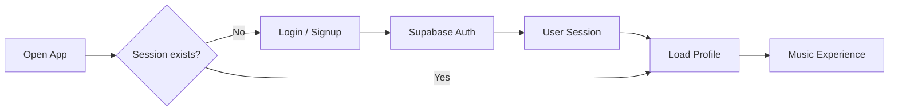
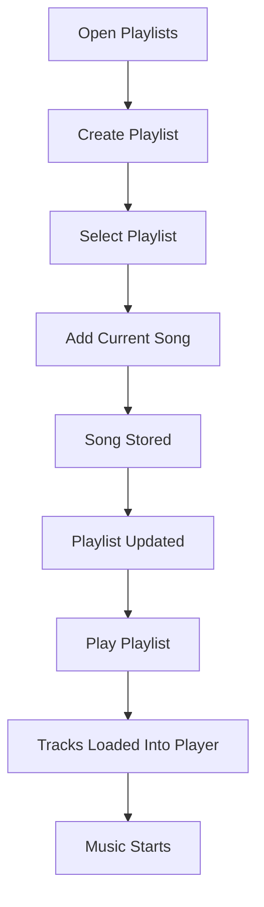
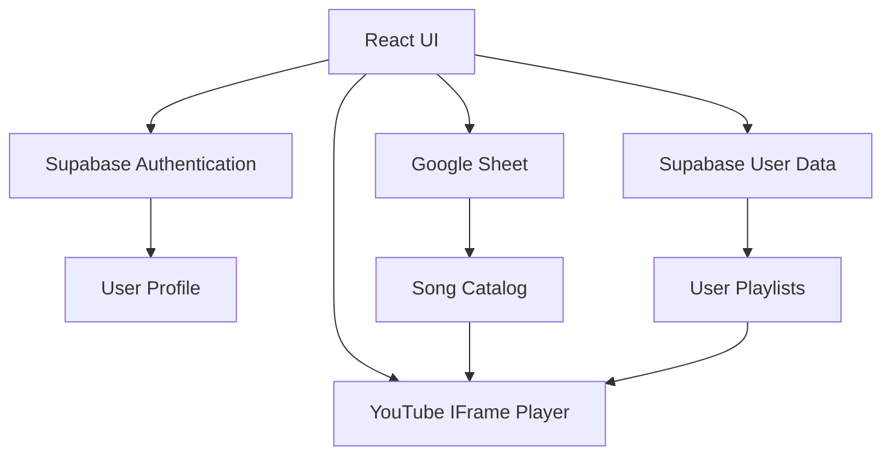

# 🎵 P’s Favourites

> **Your vibe. Your music. Your world.**  
> A personal, cinematic music experience built around the songs you
> love.

<p align="center">
<strong>🎧 Personal Music Player · 📚 Custom Playlists · 🔐 User
Accounts · 🖼️ Personal Backgrounds</strong>
</p>
<p align="center">
<a href="#-features">Features</a> • <a href="#-how-it-works">How it
works</a> • <a href="#-tech-stack">Tech Stack</a> •
<a href="#-getting-started">Getting Started</a> •
<a href="#-project-structure">Structure</a> •
<a href="#-roadmap">Roadmap</a>
</p>

------------------------------------------------------------------------

## 🌐 Live Experience

**Live deployment:** `https://p-fvrts.vercel.app`

P’s Favourites is a personal music space rather than a generic streaming
clone.

> **Open the app → log in → choose your music → play → create playlists
> → make the space yours.**

------------------------------------------------------------------------

## ✨ What is P’s Favourites?

P’s Favourites is a personalized web music player where users can:

- 🔐 Create an account and log in
- 🎵 Browse songs supplied through a Google Sheet
- ▶️ Play songs through the YouTube IFrame Player API
- ⏯️ Play, pause, skip and seek through tracks
- ❤️ Like the currently playing song
- 📋 Create personal playlists
- ➕ Add the current song to a playlist
- ▶️ Play an entire playlist
- 🖼️ Choose a personal visual background
- 👤 Manage profile information
- 💾 Store user-specific data through Supabase
- 📱 Use the experience on desktop and mobile

The song catalog is maintained through Google Sheets, so adding a song
does not require editing the UI code.

------------------------------------------------------------------------

# 🎨 Design Philosophy

P’s Favourites uses a **cinematic + glassmorphism-inspired** interface.

### Visual language

- Full-screen scenic backgrounds
- Translucent glass panels
- Soft blur and saturation
- Rounded controls
- Large visual video area
- Compact floating music player
- Minimal typography
- Hindi + English interface text
- Responsive desktop/mobile layouts

### Compact music player

The current player is intentionally a **small pill-shaped floating
control** rather than a huge dashboard.

``` text
┌──────────────────────────────────────────────────────────────┐
│  Song Name · Artist        ♡    ‹    ▶    ›    Playlist      │
└──────────────────────────────────────────────────────────────┘
```

------------------------------------------------------------------------

# 🚀 Features

## 🔐 Authentication

Users can create accounts and log in using a username + password flow.

Supabase handles authentication behind the scenes.

Internally, the username is converted into a synthetic email:

``` text
username
   ↓
username@pfavourites.local
   ↓
Supabase Authentication
```

### Authentication flow



------------------------------------------------------------------------

## 🎵 Music Catalog

Songs are loaded from a **Google Sheet**.

Required columns:

| Column      | Purpose                     |
|-------------|-----------------------------|
| `Song Name` | Song title                  |
| `Artist`    | Artist name                 |
| `URL`       | YouTube / YouTube Music URL |

Example:

``` text
Song Name        | Artist       | URL
-----------------|--------------|-------------------------
Song A           | Artist A     | https://youtube.com/...
Song B           | Artist B     | https://youtu.be/...
```

The application fetches the sheet as CSV, parses the rows, extracts
YouTube IDs and converts them into track objects.

------------------------------------------------------------------------

## ▶️ YouTube Playback

The application uses the **YouTube IFrame Player API**.

Playback state is synchronized with React state:

``` text
YouTube Player
      │
      ├── Playing
      ├── Paused
      ├── Ended
      ├── Current Time
      └── Duration
             │
             ▼
        React State
             │
             ▼
       Custom UI Controls
```

When a track ends, the player can move to the next track in the active
queue.

------------------------------------------------------------------------

## 📋 Personal Playlists

Users can create their own playlists.

A playlist can contain:

- Playlist name
- Songs
- Song order
- Current user’s ownership

### Playlist workflow



Supported actions include:

- Create playlist
- Select playlist
- Load playlist songs
- Add current song
- Play selected playlist

------------------------------------------------------------------------

## ❤️ Like Interaction

The player includes a heart interaction for the currently playing song.

The idea is intentionally simple:

> **These are your favourites — not an endless algorithmic feed.**

------------------------------------------------------------------------

## 🖼️ Personal Backgrounds

The application supports multiple visual backgrounds selected through
the user’s profile.

The current implementation includes scenes such as:

- 🌄 Village
- 🌇 Sunset
- 🏔️ Mountains
- 🌆 City

Backgrounds can be local assets or external image sources.

------------------------------------------------------------------------

# 🧠 How It Works

At a high level, the application has four major layers:



### Application flow

``` text
1. Open application
        ↓
2. Check authentication session
        ↓
3. Login / Signup if necessary
        ↓
4. Load user profile
        ↓
5. Load songs from Google Sheet
        ↓
6. Extract YouTube video IDs
        ↓
7. Initialize YouTube player
        ↓
8. Render music experience
        ↓
9. Play / pause / skip / seek
        ↓
10. Create and play personal playlists
```

------------------------------------------------------------------------

# 🛠️ Tech Stack

| Technology            | Role                                   |
|-----------------------|----------------------------------------|
| ⚛️ React              | UI and application state               |
| 🟨 JavaScript         | Application logic                      |
| 🎨 CSS                | Custom visual system and responsive UI |
| ▶️ YouTube IFrame API | Music/video playback                   |
| 📊 Google Sheets      | Song catalog                           |
| 🔐 Supabase           | Authentication + user data             |
| ▲ Vercel              | Deployment                             |
| 🐙 GitHub             | Source control                         |

------------------------------------------------------------------------

# 📁 Project Structure

A simplified structure:

``` text
P's-Favourites/
│
├── public/
│   └── assets/
│       ├── village-background.png
│       └── ...
│
├── src/
│   ├── main.jsx
│   ├── styles.css
│   └── ...
│
├── package.json
├── README.md
└── ...
```

### Important files

#### `main.jsx`

Contains the application logic for:

- Authentication
- Profile loading
- Song loading
- YouTube player
- Playback controls
- Playlist logic
- Profile/playlist panels

#### `styles.css`

Contains:

- Layout
- Background
- Glass effects
- Video card
- Music player
- Playlist UI
- Responsive behavior
- Mobile styling

------------------------------------------------------------------------

# 🔌 Data Architecture

## Google Sheets → Music Catalog

``` text
Google Sheet
     │
     │ CSV
     ▼
loadSongs()
     │
     ▼
parseCSV()
     │
     ▼
YouTube ID extraction
     │
     ▼
React tracks[]
     │
     ▼
YouTube Player
```

The application expects:

``` text
Song Name
Artist
URL
```

Rows without a usable ID, title or artist are filtered out.

------------------------------------------------------------------------

## Supabase → User Data

Conceptually:

``` text
Supabase
│
├── Authentication
│   ├── User
│   └── Session
│
├── Profiles
│   ├── Display name
│   ├── Username
│   └── Background preference
│
└── Playlists
    ├── Playlist
    └── Playlist Songs
```

------------------------------------------------------------------------

# ⚙️ Getting Started

## 1. Clone

``` bash
git clone <your-repository-url>
cd P-s-Favourites
```

## 2. Install

``` bash
npm install
```

## 3. Run locally

``` bash
npm run dev
```

Then open the local URL shown by Vite, usually:

``` text
http://localhost:5173
```

------------------------------------------------------------------------

# 🔑 Configuration

The project needs:

- Google Sheet access
- Supabase project
- Supabase authentication
- YouTube IFrame API

For production, configuration should be stored in environment variables.

Example:

``` env
VITE_SUPABASE_URL=your_supabase_url
VITE_SUPABASE_PUBLISHABLE_KEY=your_publishable_key
VITE_SHEET_URL=your_google_sheet_csv_url
```

Then:

``` js
const SUPABASE_URL =
  import.meta.env.VITE_SUPABASE_URL;

const SUPABASE_KEY =
  import.meta.env.VITE_SUPABASE_PUBLISHABLE_KEY;
```

> ⚠️ Never put Supabase service-role keys, database passwords, private
> API keys, access tokens or refresh tokens into frontend source code.

------------------------------------------------------------------------

# 📊 Google Sheet Setup

Create a sheet with:

``` text
Song Name | Artist | URL
```

Example:

``` text
Perfect | Ed Sheeran | https://www.youtube.com/watch?v=...
Tum Ho | Mohit Chauhan | https://www.youtube.com/watch?v=...
```

The application reads the sheet as CSV.

------------------------------------------------------------------------

# 🗄️ Supabase Setup

Create a Supabase project and configure Authentication.

The current application uses username-based authentication internally
through:

``` text
pfavourites.local
```

For example:

``` text
priyam
```

becomes:

``` text
priyam@pfavourites.local
```

For production:

- Enable appropriate authentication settings
- Enable Row Level Security
- Restrict profile access to the owner
- Restrict playlist access to the owner
- Keep server-side secrets off the client

------------------------------------------------------------------------

# 🎧 Player Controls

| Control  | Action                   |
|----------|--------------------------|
| ▶️       | Play / Pause             |
| ‹        | Previous track           |
| ›        | Next track               |
| ♡        | Like                     |
| Playlist | Open playlist controls   |
| Seek     | Jump to another position |

The player tracks:

``` text
playing
progress
elapsed
duration
volume
current track
queue
```

------------------------------------------------------------------------

# 📱 Responsive Design

Desktop:

``` text
             VIDEO
               ↓
          MUSIC PILL
```

Mobile:

``` text
      VIDEO
        ↓
   ┌────────────────┐
   │ 🎵  ♡  ‹  ▶  › │
   └────────────────┘
```

The player becomes shorter and tighter on smaller screens while keeping
the important controls usable.

------------------------------------------------------------------------

# 🧩 UI Architecture

``` text
App
│
├── Authentication
│   ├── Login
│   └── Signup
│
├── Main Scene
│   ├── Navbar
│   ├── Profile
│   ├── Background
│   ├── Video Player
│   └── Music Player
│
└── Panels
    ├── Profile Panel
    └── Playlist Panel
```

------------------------------------------------------------------------

# 💡 Why Google Sheets?

Google Sheets works as a lightweight content-management layer.

Instead of:

``` text
Add song
   ↓
Edit code
   ↓
Commit
   ↓
Deploy
```

the workflow becomes:

``` text
Add song to Sheet
       ↓
Application fetches CSV
       ↓
Song appears in catalog
```

Simple. Fast. No tiny database admin panel needed just to add a song.

------------------------------------------------------------------------

# 🚀 Deployment

Recommended production flow:

``` text
Local Code
    │
    ▼
GitHub
    │
    ▼
Vercel
    │
    ▼
Production Website
```

Push updates:

``` bash
git add .
git commit -m "Update P's Favourites"
git push origin main
```

When GitHub is connected to Vercel, new commits can trigger deployments
automatically.

------------------------------------------------------------------------

# 🧪 Development Workflow

``` bash
# Development
npm run dev

# Stage
git add .

# Commit
git commit -m "Describe the change"

# Push
git push origin main
```

Good commit messages:

``` text
Add playlist deletion
Fix mobile player
Improve background selector
Add song search
```

Avoid:

``` text
update
changes
final final
new new
```

Git history deserves a little dignity. 😄

------------------------------------------------------------------------

# 🐛 Troubleshooting

<details>
<summary>
<strong>🎵 Songs are not loading</strong>
</summary>

Check:

1.  Google Sheet accessibility
2.  Sheet URL
3.  Header names
4.  YouTube URLs
5.  Browser console

Required headers:

``` text
Song Name
Artist
URL
```

</details>
<details>
<summary>
<strong>▶️ YouTube player is blank</strong>
</summary>

Check:

- Valid YouTube video ID
- YouTube IFrame API loading
- Browser console
- Whether the video allows embedding

</details>
<details>
<summary>
<strong>🔐 Login is not working</strong>
</summary>

Check:

- Supabase URL
- Publishable/anon key
- Authentication configuration
- Session handling
- Supabase policies

</details>
<details>
<summary>
<strong>📋 Playlist is empty</strong>
</summary>

Check:

- User is authenticated
- Playlist belongs to the current user
- Playlist-song relationship exists
- Supabase policies allow access

</details>
<details>
<summary>
<strong>🎨 Background is not showing</strong>
</summary>

Check:

- Asset filename
- `/public/assets/` path
- CSS background rules
- External image availability

</details>

------------------------------------------------------------------------

# 🔒 Security Notes

Never commit:

``` text
.env
.env.local
private API keys
service-role keys
database passwords
access tokens
refresh tokens
```

Recommended `.gitignore`:

``` gitignore
.env
.env.local
.env.production
node_modules/
dist/
```

Frontend code cannot hide true secrets.

If an operation requires a private credential, move that operation to a
secure backend/server function.

------------------------------------------------------------------------

# 🗺️ Roadmap

## ✅ Current

- [x] User authentication
- [x] Profile-based experience
- [x] Google Sheet music catalog
- [x] YouTube playback
- [x] Play / pause
- [x] Previous / next
- [x] Playlist creation
- [x] Add songs to playlists
- [x] Playlist playback
- [x] Custom backgrounds
- [x] Responsive player
- [x] Compact pill music control

## 🔜 Next

- [ ] Playlist deletion
- [ ] Rename playlists
- [ ] Remove individual songs
- [ ] Drag-and-drop playlist ordering
- [ ] Persistent liked songs
- [ ] Search
- [ ] Recently played
- [ ] Recently added
- [ ] Better mobile navigation
- [ ] Keyboard shortcuts
- [ ] Better loading states
- [ ] Better error handling

## 🚀 Future

- [ ] Public/private playlists
- [ ] Shareable playlists
- [ ] Profile customization
- [ ] Music statistics
- [ ] Listening history
- [ ] Favorite artists
- [ ] Theme system
- [ ] PWA / installable app
- [ ] Offline UI shell
- [ ] Admin music management
- [ ] Server-side API layer

------------------------------------------------------------------------

# 💭 Project Vision

P’s Favourites is **not trying to be Spotify**.

It is a **personal digital music room**.

``` text
Your songs
    +
Your playlists
    +
Your background
    +
Your profile
    +
Your vibe
```

come together in one focused web experience.

------------------------------------------------------------------------

# 🤝 Contributing

1.  Fork the repository
2.  Create a branch

``` bash
git checkout -b feature/my-feature
```

3.  Make your changes
4.  Test locally
5.  Commit

``` bash
git commit -m "Add my feature"
```

6.  Push

``` bash
git push origin feature/my-feature
```

7.  Open a Pull Request

------------------------------------------------------------------------

# 📜 License

Add your preferred license before making the repository public.

Example:

``` text
MIT License
```

------------------------------------------------------------------------

# 👨‍💻 Author

**Priyam**

Built as a personal web development project focused on:

- React
- JavaScript
- UI/UX
- APIs
- Authentication
- Database-backed features
- Deployment
- Real-world product building

------------------------------------------------------------------------

<p align="center">

### 🎧 P’s Favourites

**Your vibe. Your music. Your world.**

Made with ❤️ and a questionable number of CSS tweaks.

</p>
